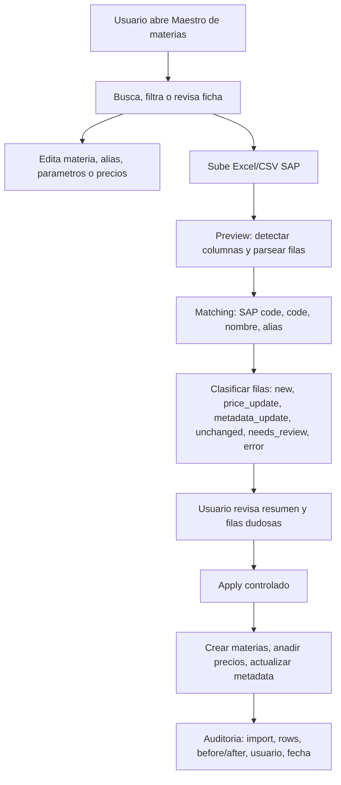

# Maestro de materias primas e importacion SAP

Estado: borrador vivo de alto nivel a implementacion
Fecha: 2026-06-13
Rama documental: `codex/raw-material-master-sap-plan`

## Fuentes revisadas

- `apps/api/src/formulia_api/models.py`
- `apps/api/src/formulia_api/schemas.py`
- `apps/api/src/formulia_api/main.py`
- `apps/web/app/raw-materials-panel.tsx`
- `apps/web/app/raw-material-actions.ts`
- `apps/web/app/raw-material-api.ts`
- `scripts/import_raw_materials_csv.py`
- `docs/01-product/specs.md`
- `docs/02-architecture/api_spec.md`
- `docs/03-domain/erp_integrations.md`

## Diagnostico actual

El apartado actual de materias primas funciona como alta rapida y apoyo a formulacion, pero todavia no como maestro completo de materias primas.

Capacidades existentes:

- Backend tenant-scoped para crear, listar, leer y editar materias primas.
- Backend para crear alias, precios y valores de parametros.
- Catalogo filtrable para el Formula Builder.
- Script tecnico CSV para cargar materias, precios y parametros.
- Tablas de auditoria basica de importacion: `raw_material_imports` y `raw_material_import_rows`.

Brechas principales:

- La UI no expone edicion completa, ficha de materia, activar/desactivar, obsoletos ni precios historicos.
- No existe endpoint de lectura de historico de precios.
- No existe borrado; esto puede ser correcto, pero debe quedar como decision: desactivar/obsoletar antes que borrar.
- La API acepta duplicados de codigo/nombre y precios negativos.
- La importacion SAP actual es script CSV directo, no flujo de usuario con preview, staging, revision y apply.
- El catalogo del Formula Builder y el maestro de materias primas estan mezclados conceptualmente; deben servir a usos distintos.

Foto remota revisada del tenant `atlantica-agricola` el 2026-06-13:

- 373 materias primas.
- 373 activas.
- 0 obsoletas.
- 373 con codigo interno.
- 309 con codigo externo/SAP.
- 313 con precio vigente.
- 60 sin precio.
- Sin duplicados por `code`.
- Sin duplicados por `normalized_name`.
- Ultima importacion registrada: `materias_primas_actualizada_2026-06.csv`.

## Objetivo

Crear un modulo de Maestro de Materias Primas que permita mantener el catalogo tecnico y economico del tenant de forma comoda, auditable y preparada para SAP.

El modulo debe permitir:

- consultar y filtrar materias primas,
- crear y editar ficha completa,
- marcar activa/inactiva y obsoleta/no obsoleta,
- gestionar alias,
- gestionar parametros tecnicos,
- ver y anadir precios historicos,
- subir Excel/CSV de SAP,
- previsualizar cambios,
- aplicar altas y actualizaciones de precio de forma controlada,
- conservar trazabilidad de cada importacion.

## Principios

1. SAP no escribe directo en el maestro.
2. Todo fichero SAP pasa por preview/staging antes de aplicar.
3. El precio interno no se sobrescribe sin guardar historico.
4. Las materias no se borran por defecto; se inactivan u obsoletan.
5. Codigo SAP y codigo interno son conceptos separados.
6. El catalogo de formulacion debe ser rapido; el maestro debe ser completo.
7. El usuario debe poder revisar los cambios antes de aplicarlos.
8. Cada decision de importacion debe quedar auditable.

## No objetivos iniciales

Fuera del primer MVP:

- conexion SAP OData en tiempo real,
- SFTP programado,
- conversion avanzada de monedas,
- gestion de stock por planta,
- documentos tecnicos/RAG asociados a materia,
- firmas o aprobacion multiusuario,
- borrado fisico de materias usadas en formulas.

Estas capacidades pueden planificarse despues sobre el mismo modelo.

## Glosario

- Maestro: vista administrativa completa de materias primas.
- Catalogo: lista optimizada para seleccionar materias dentro de una formula.
- Materia nueva: fila SAP que no matchea ninguna materia existente.
- Actualizacion de precio: fila SAP que coincide con una materia y trae precio diferente.
- Cambio de metadata: variacion en nombre, estado, familia, proveedor u otro campo no economico.
- Staging: datos importados pendientes de revision/aplicacion.
- Apply: accion que convierte staging en cambios reales del maestro.

## Workflow objetivo



## Experiencia de usuario deseada

### Entrada ideal

La entrada principal debe ser una vista `Materias primas` orientada a mantenimiento, no solo a alta rapida.

Pantalla propuesta:

- Cabecera con totales: materias, activas, obsoletas, sin precio, sin SAP, cambios pendientes.
- Barra de busqueda global por nombre, codigo, codigo SAP y alias.
- Filtros: familia, estado, obsoleto, con/sin precio, con/sin codigo SAP, import origen, fecha de precio.
- Tabla densa con columnas configurables.
- Ficha lateral o panel detalle para editar sin perder la lista.
- Accion destacada: `Importar SAP`.

### Tabla maestro

Columnas MVP:

- codigo interno,
- codigo SAP,
- nombre,
- familia,
- estado activo,
- obsoleto,
- precio vigente EUR/kg,
- fecha precio,
- fuente precio,
- numero de parametros tecnicos,
- alias,
- ultima actualizacion.

Acciones MVP:

- abrir ficha,
- editar,
- marcar obsoleta,
- anadir precio,
- anadir alias,
- usar en formula.

### Ficha de materia

Tabs o secciones:

- General: codigos, nombre, familia, subfamilia, estado fisico, densidad, pH, solubilidad, notas.
- Parametros: valores tecnicos editables por parametro activo del tenant.
- Precios: historico, precio vigente, fuente, proveedor, validez.
- Alias: nombres alternativos para matching.
- Auditoria: importaciones y cambios relevantes.

### Import SAP

Flujo de usuario:

1. Subir fichero `.xlsx`, `.xls` o `.csv`.
2. Elegir hoja si hay varias.
3. Confirmar mapeo de columnas si el detector no esta seguro.
4. Ver preview con resumen.
5. Revisar filas `needs_review`.
6. Aplicar solo cambios seleccionados o todos los cambios validos.
7. Descargar reporte de aplicacion.

Estados por fila:

- `new_material`: no existe en maestro; se puede crear.
- `price_update`: materia existente con precio nuevo.
- `metadata_update`: materia existente con cambio de nombre/estado/familia/etc.
- `unchanged`: sin cambios.
- `needs_review`: candidato ambiguo.
- `error`: fila invalida.
- `skipped`: excluida por el usuario.
- `applied`: aplicada.

## Logica de matching SAP

Orden recomendado:

1. `external_code` exacto contra codigo SAP.
2. `code` exacto contra codigo interno si SAP no viene informado.
3. `normalized_name` exacto.
4. alias normalizado.
5. fuzzy match por nombre con score.
6. manual review.

Reglas:

- Si hay mas de un candidato fuerte, la fila queda `needs_review`.
- Si hay codigo SAP nuevo y nombre parecido a una materia existente sin codigo SAP, sugerir enlace, no aplicar automatico.
- Si el precio falta o es cero, no crear precio; la fila puede actualizar metadata si procede.
- Si el precio es negativo, bloquear fila como `error`.
- Si la unidad no es kg o la moneda no es EUR, marcar `needs_review` salvo politica tenant explicita.

## Politicas por tenant

Configuracion recomendada:

```json
{
  "raw_material_master": {
    "sap_import_enabled": true,
    "auto_apply_price_updates": false,
    "auto_create_new_materials": false,
    "allow_negative_prices": false,
    "default_currency": "EUR",
    "default_unit": "kg",
    "match_threshold": 0.88,
    "require_review_for_obsolete_changes": true,
    "require_review_for_name_changes": true
  }
}
```

Atlantica MVP:

- SAP import activo.
- Autoaplicar precios solo tras preview y confirmacion.
- Nuevas materias requieren seleccion o confirmacion explicita.
- Obsoletos requieren confirmacion.
- Moneda EUR y unidad kg por defecto.

## Modelo de datos

### Existente

`raw_materials`

- `code`
- `external_code`
- `name`
- `normalized_name`
- `family`
- `subfamily`
- `physical_state`
- `density`
- `ph_min`
- `ph_max`
- `solubility`
- `is_active`
- `is_obsolete`
- `notes`

`raw_material_prices`

- `raw_material_id`
- `price`
- `currency`
- `unit`
- `supplier`
- `source`
- `valid_from`
- `valid_to`

`raw_material_parameter_values`

- `raw_material_id`
- `parameter_id`
- `value`
- `source`
- `confidence`

`raw_material_aliases`

- `raw_material_id`
- `alias`
- `normalized_alias`
- `source`

`raw_material_imports`

- `file_name`
- `source`
- `source_hash`
- `status`
- `summary_json`

`raw_material_import_rows`

- `import_id`
- `row_number`
- `raw_material_id`
- `raw_name`
- `action`
- `status`
- `raw_row_json`
- `message`

### Cambios propuestos

Preferencia: extender tablas existentes de importacion antes que crear un subsistema paralelo.

Campos nuevos sugeridos para `raw_material_import_rows`:

- `raw_code`
- `raw_external_code`
- `matched_raw_material_id`
- `match_type`
- `match_score`
- `parsed_json`
- `diff_json`
- `before_json`
- `after_json`
- `selected_action`
- `applied_at`
- `applied_by`

Campos nuevos sugeridos para `raw_material_imports`:

- `import_type`: `sap_excel`, `sap_csv`, `manual_csv`
- `sheet_name`
- `column_mapping_json`
- `policy_json`
- `created_by`
- `applied_at`
- `applied_by`

Indices/constraints:

- indice `(tenant_id, external_code)` para busqueda SAP.
- indice `(tenant_id, code)` para busqueda interna.
- indice `(tenant_id, normalized_name)`.
- evitar duplicados activos por `(tenant_id, code)` cuando `code` no sea null.
- evitar duplicados activos por `(tenant_id, external_code)` cuando `external_code` no sea null.
- `raw_material_prices.price >= 0`.

Decision pendiente:

- En Postgres, usar indices unicos parciales para `code`/`external_code` no nulos.
- En SQLite/test, simular con validacion de servicio si el soporte parcial complica migraciones.

## API propuesta

### Maestro

```http
GET /api/v1/raw-materials?query=&family=&status=&price_filter=&sap_filter=&limit=&offset=
GET /api/v1/raw-materials/{raw_material_id}
POST /api/v1/raw-materials
PATCH /api/v1/raw-materials/{raw_material_id}
GET /api/v1/raw-materials/{raw_material_id}/prices
POST /api/v1/raw-materials/{raw_material_id}/prices
POST /api/v1/raw-materials/{raw_material_id}/aliases
POST /api/v1/raw-materials/{raw_material_id}/parameter-values
```

Borrado:

```http
PATCH /api/v1/raw-materials/{raw_material_id}
```

con `is_active=false` o `is_obsolete=true`. No implementar `DELETE` en el MVP salvo que se limite a materias sin uso.

### Import SAP

```http
POST /api/v1/raw-material-imports/sap/preview
GET /api/v1/raw-material-imports/{import_id}
PATCH /api/v1/raw-material-imports/{import_id}/rows/{row_id}
POST /api/v1/raw-material-imports/{import_id}/apply
GET /api/v1/raw-material-imports/{import_id}/report
```

`preview`:

- recibe fichero multipart,
- detecta hojas,
- parsea columnas,
- genera staging,
- no cambia maestro.

`apply`:

- aplica solo filas `ready` o seleccionadas,
- crea materias,
- actualiza metadata permitida,
- anade nuevo precio historico,
- guarda before/after,
- actualiza resumen del import.

## Servicios backend

Servicios propuestos:

- `raw_material_master.py`: reglas de CRUD, validaciones, duplicados y precio vigente.
- `raw_material_import.py`: parseo Excel/CSV, preview, matching, diff y apply.
- `raw_material_excel.py`: lectura de fichero y normalizacion de columnas.
- `raw_material_audit.py`: snapshots before/after y resumen.

Reglas criticas:

- no aceptar materia sin nombre,
- no aceptar precio negativo,
- no crear duplicado por codigo activo,
- no crear duplicado por codigo SAP activo,
- no actualizar nombre desde SAP automaticamente si el cambio es grande,
- no marcar obsoleto automaticamente salvo politica explicita,
- no borrar precio historico; crear nueva fila o cerrar vigencia anterior.

## UI propuesta

Componentes:

- `raw-material-master-panel.tsx`
- `raw-material-master-table.tsx`
- `raw-material-detail-drawer.tsx`
- `raw-material-general-form.tsx`
- `raw-material-price-history.tsx`
- `raw-material-parameter-grid.tsx`
- `raw-material-alias-list.tsx`
- `raw-material-sap-import-panel.tsx`
- `raw-material-import-preview-table.tsx`
- `raw-material-import-summary.tsx`

Estado/hooks:

- `raw-material-master-state.ts`
- `raw-material-master-actions.ts`
- `raw-material-import-state.ts`
- `raw-material-import-actions.ts`
- `raw-material-import-api.ts`

UX minima:

- tabla densa pero legible,
- filtros persistentes mientras se navega,
- detalle lateral sin cambiar de pantalla,
- import SAP en modal/panel dentro de `Materias primas`,
- resumen antes de apply,
- errores por fila con mensaje claro,
- chips de estado: `nuevo`, `precio`, `metadata`, `sin cambios`, `revision`, `error`.

## Capas de implementacion

| Capa | Nombre | Resultado | Estado |
| --- | --- | --- | --- |
| L0 | Diagnostico | Brechas CRUD/SAP y datos actuales | Hecho |
| L1 | Producto | Maestro vs catalogo, workflows y no objetivos | Este documento |
| L2 | Datos | Constraints, precios historicos e import staging | Planificado |
| L3 | Backend CRUD | Validaciones, filtros, price history | Planificado |
| L4 | Backend import | Preview, matching, diff, apply | Planificado |
| L5 | UI maestro | Tabla, filtros, ficha, edicion | Planificado |
| L6 | UI import SAP | Upload, preview, revision, apply | Planificado |
| L7 | Testing | Unit/API/import/frontend/Playwright | Planificado |
| L8 | Migracion Atlantica | Validar 373 materias y siguiente Excel SAP | Planificado |
| L9 | Rollout | PRs pequenos, rollback, documentacion | Planificado |

## Ramas y commits propuestos

### Rama 0 - Documento

Branch: `codex/raw-material-master-sap-plan`

Commits:

1. `docs: plan raw material master and SAP import`

Checks:

- revisar markdown,
- `git diff --check`.

### Rama 1 - Guardrails backend

Branch: `codex/raw-material-master-guardrails`

Commits:

1. `api: validate raw material prices and duplicates`
   - bloquear precio negativo,
   - bloquear duplicado por codigo activo,
   - bloquear duplicado por codigo SAP activo,
   - normalizar errores `409`/`400`.
2. `test: cover raw material master guardrails`
   - duplicado code,
   - duplicado external_code,
   - precio negativo,
   - update que genera duplicado.

Checks:

- `.venv\Scripts\python.exe -m pytest apps/api/tests/test_api_foundation.py`
- `.venv\Scripts\python.exe -m pytest apps/api/tests/test_excel_import.py`

### Rama 2 - Price history API

Branch: `codex/raw-material-price-history-api`

Commits:

1. `api: expose raw material price history`
   - `GET /api/v1/raw-materials/{id}/prices`,
   - ordenar por `valid_from desc`, `created_at desc`.
2. `api: close previous price validity on new current price`
   - opcional si se decide usar `valid_to`.
3. `test: cover raw material price history`
   - varios precios,
   - precio vigente correcto,
   - tenant scoped.

Checks:

- tests API foundation,
- test de calculo de formula con precio vigente.

### Rama 3 - SAP import backend preview

Branch: `codex/raw-material-sap-import-preview`

Commits:

1. `api: add raw material import parser`
   - soporte `.xlsx`/`.csv`,
   - seleccion de hoja,
   - normalizacion de columnas conocidas.
2. `api: add SAP import preview endpoint`
   - crea `raw_material_imports`,
   - crea filas staging,
   - clasifica acciones.
3. `test: cover SAP import preview`
   - new material,
   - price update,
   - unchanged,
   - needs review,
   - invalid price.

Checks:

- fixtures pequenos `.xlsx` y `.csv`,
- no cambios en maestro durante preview.

### Rama 4 - SAP import apply

Branch: `codex/raw-material-sap-import-apply`

Commits:

1. `api: add SAP import row review updates`
   - cambiar accion seleccionada,
   - seleccionar candidato manual.
2. `api: apply SAP import rows`
   - crear materias,
   - anadir precios,
   - actualizar metadata permitida,
   - guardar before/after.
3. `test: cover SAP import apply idempotency`
   - aplicar una vez,
   - reintento no duplica,
   - filas error no aplican,
   - rollback logico documentado.

Checks:

- API tests,
- import preview/apply sobre fixture representativo de Atlantica.

### Rama 5 - UI maestro

Branch: `codex/raw-material-master-ui`

Commits:

1. `web: add raw material master table filters`
   - busqueda,
   - filtros,
   - columnas principales.
2. `web: add raw material detail drawer`
   - general,
   - alias,
   - parametros,
   - precios.
3. `web: wire raw material edit actions`
   - PATCH general,
   - add alias,
   - add price,
   - update parameter values.
4. `test: add raw material master UI smoke`
   - si hay framework e2e disponible.

Checks:

- `npm run typecheck --workspace apps/web`
- `npm run build:web`
- Playwright desktop y movil.

### Rama 6 - UI import SAP

Branch: `codex/raw-material-sap-import-ui`

Commits:

1. `web: add SAP import upload flow`
   - fichero,
   - hoja,
   - preview.
2. `web: add SAP import review table`
   - resumen,
   - filtros por estado,
   - mensajes por fila.
3. `web: add SAP import apply flow`
   - aplicar,
   - reporte,
   - refrescar maestro.
4. `test: add SAP import Playwright coverage`
   - preview,
   - fila needs review,
   - apply.

Checks:

- typecheck,
- build,
- Playwright con fixture local.

### Rama 7 - Atlantica validation

Branch: `codex/raw-material-atlantica-sap-validation`

Commits:

1. `docs: record Atlantica raw material import validation`
   - totales antes/despues,
   - fichero probado,
   - filas aplicadas/omitidas.
2. `chore: add admin script for SAP import dry run`
   - si se necesita operativa fuera de UI.

Checks:

- preview contra siguiente Excel SAP real,
- apply solo tras confirmacion,
- comparar totales y precios.

## Testing

### Backend unit/API

Casos obligatorios:

- create material valido,
- update material valido,
- update material duplicando code falla,
- update material duplicando external_code falla,
- precio negativo falla,
- precio cero permitido o bloqueado segun decision,
- price history devuelve orden correcto,
- current price toma el ultimo `valid_from`,
- alias tenant-scoped,
- parametro tenant-scoped,
- import preview no cambia maestro,
- import apply crea materia,
- import apply anade precio,
- import apply no duplica al reintentar,
- import row con candidato ambiguo no aplica sin decision.

### Import fixtures

Crear fixtures pequenos:

- `sap_raw_materials_basic.xlsx`
- `sap_raw_materials_price_update.xlsx`
- `sap_raw_materials_ambiguous.xlsx`
- `sap_raw_materials_invalid.xlsx`

Cada fixture debe tener:

- codigo SAP,
- nombre,
- precio,
- moneda,
- unidad,
- estado SAP,
- proveedor si existe,
- columnas tecnicas opcionales.

### Frontend

Checks:

- typecheck,
- build,
- no llamadas API fuera de clientes dedicados,
- estados disabled para usuarios sin permiso,
- errores visibles por campo/fila,
- tabla sin solapes en desktop y movil,
- acciones no cambian de pantalla innecesariamente.

### Playwright

Flujos:

1. Login o modo e2e seeded.
2. Abrir `Materias primas`.
3. Buscar una materia existente.
4. Abrir ficha.
5. Anadir precio.
6. Ver precio en historico y tabla.
7. Subir fixture SAP.
8. Ver preview.
9. Aplicar cambios.
10. Ver resumen y maestro actualizado.

Nota: ahora mismo la app requiere sesion Supabase real en frontend. Para Playwright estable conviene crear uno de estos soportes:

- usuario/tenant de QA con credenciales no secretas en entorno local,
- modo e2e que use Supabase local,
- bypass de auth solo en `NODE_ENV=test` y nunca en produccion.

## Validacion con usuario

Checklist de demo:

- El usuario encuentra una materia por codigo SAP.
- El usuario ve rapidamente si falta precio.
- El usuario distingue activa vs obsoleta.
- El usuario puede revisar historico de precios.
- El usuario puede subir Excel SAP y entender el resumen.
- El usuario puede detectar filas ambiguas antes de aplicar.
- El usuario puede explicar de donde salio un precio.

## Rollback

Backend:

- No borrar importaciones.
- Si un apply fue incorrecto, crear precio correctivo posterior; no editar historico silenciosamente.
- Para metadata, usar auditoria before/after para revertir manualmente.
- Para materias nuevas incorrectas, marcar inactivas/obsoletas.

UI:

- Feature flag por tenant: `raw_material_master.sap_import_enabled`.
- Si el import falla, mantener maestro anterior intacto.

## Riesgos

| Riesgo | Impacto | Mitigacion |
| --- | --- | --- |
| Excel SAP cambia columnas | Preview falla o mapea mal | detector + mapping manual + fixtures |
| Duplicados por SAP code | Maestro inconsistente | constraint/validacion tenant-scoped |
| Precio incorrecto aplicado | coste formulas mal | preview, diff, historico, confirmacion |
| Obsoletos aplicados automatico | materias desaparecen de formulacion | obsoletos requieren review |
| UI demasiado pesada | baja adopcion | tabla densa + ficha lateral + import separado |
| Auth dificulta e2e | QA incompleto | seed/mode e2e local |

## Criterios de done MVP

- La pantalla `Materias primas` permite mantener una ficha completa.
- El usuario puede ver y anadir historico de precios.
- La API bloquea duplicados y precios invalidos.
- Un Excel SAP se puede subir en UI.
- El preview clasifica filas antes de aplicar.
- El apply guarda auditoria y no duplica al reintentar.
- Tests API cubren guardrails, preview y apply.
- Playwright cubre maestro + import basico.
- Atlantica puede actualizar precios desde su fichero SAP sin tocar SQL ni scripts manuales.

## Preguntas abiertas

- Cual es el formato exacto del Excel SAP que se usara de forma recurrente.
- Si `Precio SAP EUR/kg` debe tener prioridad sobre `Precio EUR/kg` cuando ambos existan.
- Si SAP puede traer moneda distinta de EUR.
- Si hay multiples proveedores por materia.
- Si una materia con precio cero debe ser valida, warning o error.
- Si el codigo interno debe ser siempre igual al codigo SAP cuando SAP existe.
- Si una materia nueva de SAP debe crearse activa por defecto o quedar pendiente.

## Siguiente paso recomendado

No implementar todo de golpe.

Primer PR real:

1. Guardrails backend.
2. Price history API.
3. Tests.

Segundo PR:

1. Import SAP preview backend.
2. Fixtures.
3. Tests.

Tercer PR:

1. UI maestro.
2. UI price history.
3. Playwright smoke.

Cuarto PR:

1. UI import SAP.
2. Apply.
3. Validacion con Excel real de Atlantica.
